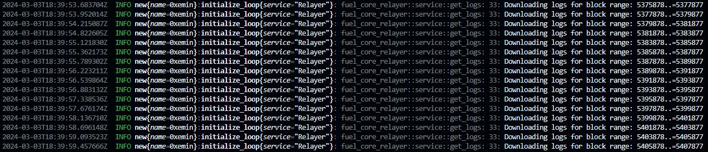

# Fuel Beta-5 Testnet Node Kurma Rehberi


Selamlar, [Fuel](https://x.com/fuel_network) Beta-5 testneti için kolay bir şekilde node kurabilmeniz için küçük bir rehber hazırlamak istedim. Orijinal dokümantasyon kafa karıştırdığı için basite indirgemeye çalıştım. Umarım açıklayıcı olmuşumdur.

Öncelikle sağ üstten repoyu yıldızlamayı ve forklamayı unutmayalım. Teşekkürler.

Ödüllü olup olmadığı hakkında bir bilgi bulamadım. Büyük ihtimalle ödülsüz çünkü bundan sonraki testnet ödüllü olacak diye [yazmışlar](https://x.com/fuel_network/status/1763253941700292835?s=20).

| Donanım    | Minimum  | Tavsiye Edilen |
|------------|----------|-----------------|
| İşlemci    | 2 Çekirdek | 8 Çekirdek     |
| Bellek     | 4 GB     | 12 GB           |
| Depolama   | 30 GB    | 100 GB          |

Sanal sunucu almak için Hetzner, Contabo ya da AWS gibi sanal makine sağlayıcılarını kullanabilirsiniz. Ücretsiz Amazon sunucunuza bile kurabilirsiniz.

## Öncelikle Rust Yüklüyoruz

```bash
curl --proto '=https' --tlsv1.2 -sSf https://sh.rustup.rs | sh
```
Birkaç seçenek çıkacak. 1 yazıp enterlıyoruz.

Kurulum bittikten sonra şu kodu kullanın:
```bash
source $HOME/.cargo/env
```

## Fuel Servislerini Yüklüyoruz

```bash
curl https://install.fuel.network | sh
```

Sizden `fuelup-init` için dosya yolunuzu değiştirmek isteyecektir, `y` yazıp enterlıyoruz. Kurulum bittikten sonra çıktıdaki `source` ile başlayan kodu kopyala yapıştır yapıp enterlıyoruz. Bunu yapmazsanız habire hata alırsınız!

## Alchemy ya da Infura'dan API Key/RPC alıyoruz

Herhangi bir RPC sağlayıcısından da ücretsiz bir şekilde Sepolia için API Key/RPC alabilirsiniz. Aldığınız RPC şu şekilde görünecek:

```bash
#Infura
https://sepolia.infura.io/v3/{API_KEYİNİZ}
#Alchemy
https://eth-sepolia.g.alchemy.com/v2/{API_KEYİNİZ}
```

RPC'nizi aldıktan sonra bir yere kaydedin, az sonra bunu kullanacağız.

## P2P Key üretiyoruz

Şu kodu girin:

```bash
fuel-core-keygen new --key-type peering
```

Çıktı olarak `peer_id, secret ve node tipinizi` verecek. Bunları kopyalayıp güvenli bir yere kaydedin. Kaydettikten sonra herhangi bir tuşa tıklayın.

## Config Dosyamızı Oluşturuyoruz

`chainConfig.json` dosyamızı oluşturup düzenleyeceğiz. Öncelikle şu kodu girelim:
```bash
nano chainConfig.json
```

[chainConfig.json](./chainConfig.json) dosyasının içerisindeki her şeyi kopyalıyoruz ve terminale yapıştırıyoruz.

Ctrl + X yaptıktan sonra `y` yazıp enterlıyoruz.

Her şeyi aynen dediğim gibi yaptıysanız artık nodeunuzu başlatmaya hazırsınız demektir.

## Nodeumuzu Başlatalım

Aşağıdaki kodu çalıştırdığınız zaman nodeunuz kısa bir sürede senkronize olacaktır. **Koddaki birkaç şeyi değiştirmemiz gerekiyor.** Aşağıda bunları açıkladım.

`{NODE_NICKINIZ}` -> Kendi nodeunuza vereceğiniz isim. Örneğin ben bu kısmı değiştirip 0xemin olarak yazdım. İstediğiniz ismi verebilirsiniz.

`{GIZLI_KELIME}` -> P2P Key Üretiyoruz kısmındaki çıktıda bize secret diye bir şifre vermişti. Onu buraya yazacağız.

`{RPC}` -> Alchemy ya da Infura'dan aldığınız RPC'yi buraya yazın.

**Kullanacağımız kod:**

```bash
fuel-core run \
--service-name {NODE_NICKINIZ} \
--keypair {GIZLI_KELIME} \
--relayer {RPC} \
--ip 0.0.0.0 --port 4000 --peering-port 30333 \
--db-path  ~/.fuel_beta5 \
--chain ./chainConfig.json \
--utxo-validation --poa-instant false --enable-p2p \
--min-gas-price 1 --max-block-size 18874368  --max-transmit-size 18874368 \
--reserved-nodes /dns4/p2p-beta-5.fuel.network/tcp/30333/p2p/16Uiu2HAmSMqLSibvGCvg8EFLrpnmrXw1GZ2ADX3U2c9ttQSvFtZX,/dns4/p2p-beta-5.fuel.network/tcp/30334/p2p/16Uiu2HAmVUHZ3Yimoh4fBbFqAb3AC4QR1cyo8bUF4qyi8eiUjpVP \
--sync-header-batch-size 100 \
--enable-relayer \
--relayer-v2-listening-contracts 0x557c5cE22F877d975C2cB13D0a961a182d740fD5 \
--relayer-da-deploy-height 4867877 \
--relayer-log-page-size 2000
```
---


Loglar yukarıdaki gibi akıyorsa Tebrikler, node başarılı bir şekilde kuruldu. Otomatik olarak senkron olacak. Gizli kelimelerinizi bir yere kaydetmeyi ve beni takip etmeyi unutmayın :)


**X üzerinden takipleşelim :)**

[**emin.pdf**](https://x.com/0x_Emin)